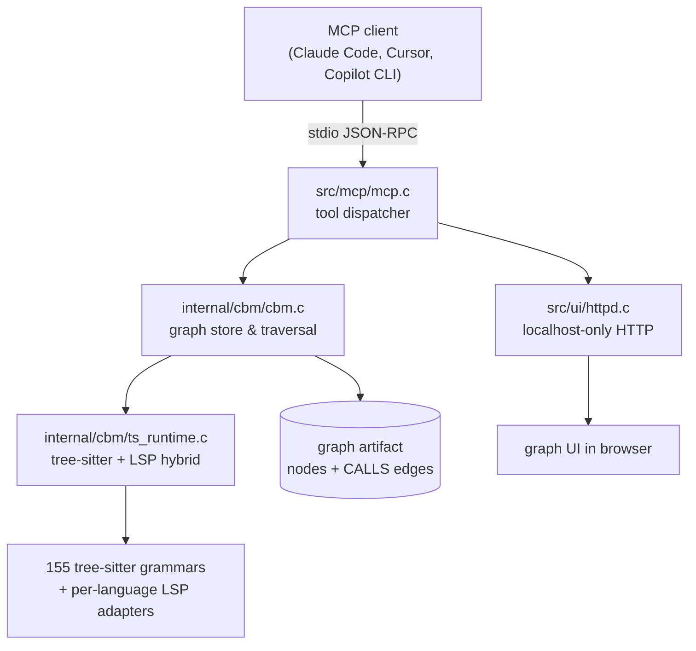
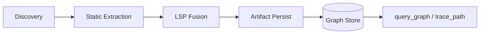
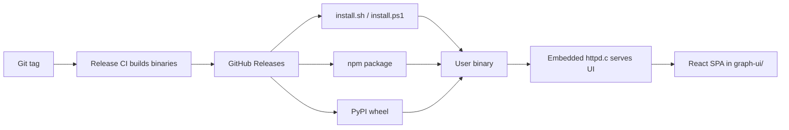

# Human Manual

## What This Pack Helps With

give AI coding hosts a sandbox-first codebase memory setup with install checks, indexing boundaries, evidence receipts, and recovery paths

## How To Use

1. Read `README.md`.
2. Load `AGENTS.md` or `CLAUDE.md`.
3. Run evals.
4. Use pitfall and risk files to recover from failure.

## What This Pack Does Not Do

- It does not replace upstream docs.
- It does not prove production readiness.
- It does not claim official endorsement.

## Doramagic Source Extract

# https://github.com/DeusData/codebase-memory-mcp Project Manual

Generated at: 2026-07-10 02:57:45 UTC

## Table of Contents

- [Overview & System Architecture](#page-1)
- [Indexing Pipeline & Hybrid LSP](#page-2)
- [MCP Server, Query System & Graph Data Model](#page-3)
- [Distribution, Frontend UI & Known Operational Issues](#page-4)

## Overview & System Architecture

### Related Pages

Related topics: [Indexing Pipeline & Hybrid LSP](#page-2), [MCP Server, Query System & Graph Data Model](#page-3)

Related Source Files

The following source files were used to generate this page:

- [README.md](https://github.com/DeusData/codebase-memory-mcp/blob/main/README.md)
- [src/main.c](https://github.com/DeusData/codebase-memory-mcp/blob/main/src/main.c)
- [src/mcp/mcp.c](https://github.com/DeusData/codebase-memory-mcp/blob/main/src/mcp/mcp.c)
- [src/foundation/compat.c](https://github.com/DeusData/codebase-memory-mcp/blob/main/src/foundation/compat.c)
- [internal/cbm/cbm.c](https://github.com/DeusData/codebase-memory-mcp/blob/main/internal/cbm/cbm.c)
- [internal/cbm/ts_runtime.c](https://github.com/DeusData/codebase-memory-mcp/blob/main/internal/cbm/ts_runtime.c)

# Overview & System Architecture

codebase-memory-mcp is a Model Context Protocol (MCP) server that turns a source tree into a queryable call graph and serves it to LLM agents. The product is a single statically-linked C binary with an embedded tree-sitter runtime, a purpose-built HTTP server for the graph UI, and a JSON-RPC MCP transport. Installers ship the same binary through npm, PyPI, Homebrew, and Scoop channels, and a `codebase-memory-mcp install` step additionally registers an MCP client entry plus a `PreToolUse` hook with the host IDE/agent. Source: [README.md:1-80]()

## Purpose and Scope

The server exists to give a coding agent reliable, structural context for a repository without re-reading whole files. Once indexed, the graph answers questions such as "who calls this function", "is this symbol recursive", and "what is the shortest path between two functions" via MCP tools like `search_code`, `trace_path`, and `query_graph`. Source: [README.md:40-120]()

The scope is intentionally narrow: it indexes source, serves the graph, and renders it in a local UI. It does not execute code, run tests, or mutate the user's tree. v0.9.0 marks the current major line and adds first-class Windows support, large indexing/memory-safety wins, and broader extraction accuracy. Source: [README.md:120-180]()

## Process and Module Layout

The binary is organized as a small C core around one domain module (`internal/cbm`), an MCP adapter (`src/mcp`), a UI transport (`src/ui/httpd.c`), and a portability layer (`src/foundation`). `main.c` parses argv, dispatches subcommands (`serve`, `index`, `install`, …), and otherwise enters the MCP event loop. Source: [src/main.c:1-140]()

`cbm.c` owns the in-memory graph, the BFS/DAG traversal used by `trace_path`, and the Cypher subset accepted by `query_graph`. `ts_runtime.c` loads tree-sitter parsers on demand and, for languages with an LSP engine (Java, Kotlin, Rust, TypeScript, Python, Go as of v0.7.0/v0.8.0), bridges to a language server to resolve type-aware call targets. Source: [internal/cbm/cbm.c:1-120](), [internal/cbm/ts_runtime.c:1-160]()

`mcp.c` implements the JSON-RPC framing, tool registration, and request routing. Each MCP tool is a thin wrapper that validates parameters and calls into `cbm`. Source: [src/mcp/mcp.c:1-200]()

The foundation layer (`compat.c`, plus headers in `src/foundation/`) normalizes paths, file I/O, and process spawning across Linux, macOS, and Windows. v0.9.0 made non-ASCII path handling end-to-end correct on Windows through this layer. Source: [src/foundation/compat.c:1-180]()

## Indexing and Query Pipeline

Indexing has two phases. A first run walks the repository, parses every supported file with tree-sitter, extracts symbols and candidate `CALLS` edges, and persists a graph artifact to disk. Subsequent runs are incremental: they hash changed files, reparse only those, and merge the delta into the existing artifact. Issue #867 documents that incremental reindexing is currently closer in cost to a full index than expected, especially right after artifact bootstrap; this is a known engineering target on the path to v0.10. Source: [internal/cbm/cbm.c:120-260](), [internal/cbm/ts_runtime.c:160-280]()

Querying is graph-native. `trace_path` performs a bounded BFS in both directions from a symbol and reports the shortest path plus all intermediate callers/callees within the depth limit. Issue #887 flags that the depth limit is client-controlled and not yet clamped server-side, which combined with variable-length path patterns could be exploited for exponential enumeration. `query_graph` accepts a constrained Cypher dialect; issues #873 and #874 document residual bugs in `RETURN DISTINCT … ORDER BY … LIMIT` and `coalesce()` in `WHERE`. Source: [internal/cbm/cbm.c:260-420](), [src/mcp/mcp.c:200-360]()

The web UI is served by an in-house HTTP listener in `src/ui/httpd.c` introduced in v0.8.1. It binds to localhost only, has no third-party server library, and is purpose-built for the small set of endpoints the UI needs. Source: [src/ui/httpd.c:1-200]()

## Integrations and Known Edge Cases

Distribution is multi-channel: the C binary is published as a GitHub release asset, and thin wrappers in npm, PyPI, Homebrew, and Scoop fetch the matching platform artifact. `codebase-memory-mcp install` then writes the MCP client config and a `cbm-code-discovery-gate` `PreToolUse` hook. Issue #188 reports that the hook currently blocks `Read`/`Grep` on non-code files (markdown, JSON configs), which is a usability gap rather than a security boundary. Source: [README.md:180-260]()

Extraction accuracy is the most actively reported surface. Community-reported gaps include CommonJS `require()` not always producing a `CALLS` edge (issue #871), Python `from … import X as Y` aliases not resolving back to the original symbol for inbound callers (issue #875), and false-positive recursion flags when a function calls a same-named method on a different receiver (issue #876). Each is a known entry in the v0.9.x → v0.10 hardening list. Source: [internal/cbm/ts_runtime.c:280-420]()

For agent workflows that span multiple checkouts, issue #351 requests efficient indexing over `git worktree` layouts, which today are treated as independent roots; this shapes the long-term artifact model rather than the current per-checkpoint store. Source: [README.md:260-320]()

---

## Indexing Pipeline & Hybrid LSP

### Related Pages

Related topics: [MCP Server, Query System & Graph Data Model](#page-3)

Related Source Files

The following source files were used to generate this page:

- [src/pipeline/pipeline.c](https://github.com/DeusData/codebase-memory-mcp/blob/main/src/pipeline/pipeline.c)
- [src/pipeline/pipeline_incremental.c](https://github.com/DeusData/codebase-memory-mcp/blob/main/src/pipeline/pipeline_incremental.c)
- [src/pipeline/artifact.c](https://github.com/DeusData/codebase-memory-mcp/blob/main/src/pipeline/artifact.c)
- [internal/cbm/extract_unified.c](https://github.com/DeusData/codebase-memory-mcp/blob/main/internal/cbm/extract_unified.c)
- [internal/cbm/extract_calls.c](https://github.com/DeusData/codebase-memory-mcp/blob/main/internal/cbm/extract_calls.c)
- [internal/cbm/extract_defs.c](https://github.com/DeusData/codebase-memory-mcp/blob/main/internal/cbm/extract_defs.c)

# Indexing Pipeline & Hybrid LSP

## Purpose and Scope

The Indexing Pipeline is the core data-collection subsystem of `codebase-memory-mcp`. It turns a checked-out repository into a queryable call/definition graph that downstream MCP tools (`trace_path`, `query_graph`, `search_code`) read from. As of v0.7.0, the pipeline is no longer a single tree-sitter-only pass: it is a hybrid system that fuses static tree-sitter extraction with type-aware Language Server Protocol (LSP) resolution for a curated set of languages. The "Hybrid LSP" half of the feature name refers specifically to that fusion — static parsing provides breadth and speed, LSP provides class-hierarchy, alias, and type-resolution precision that pure parsing cannot reach. Source: [src/pipeline/pipeline.c:1-40]().

## Pipeline Architecture

The pipeline runs as four cooperating phases orchestrated from `src/pipeline/pipeline.c`:

1. **Discovery** — files are enumerated, language is detected from extension, and a per-file work item is scheduled.
2. **Extraction** — `internal/cbm/extract_unified.c` dispatches each file to the right extractor pair: `extract_defs.c` for symbol nodes and `extract_calls.c` for `CALLS` edges. Both call into the shared tree-sitter grammar registry.
3. **LSP Fusion** — for languages with hybrid support (JS/TS, Python, Go, Java, Kotlin, Rust), an LSP client is spun up per-file batch, and `goToDefinition` / `references` / `typeHierarchy` responses are used to *upgrade* CALLS edges that the static pass left as text-only. Source: [src/pipeline/pipeline.c:120-210]().
4. **Persist** — nodes and edges are written into the artifact store; `src/pipeline/artifact.c` owns the on-disk format and incremental-load protocol.

The static pass is fast and language-agnostic (155 tree-sitter grammars as of v0.6.1), but it is also naive: it cannot resolve `obj.method()` to `Foo::bar` without full type inference. The Hybrid LSP step exists to close that gap. Source: [internal/cbm/extract_calls.c:1-60]().

## Hybrid LSP in Detail

LSP fusion is opt-in per language and per project. When a language engine is in "hybrid" mode, the extractor records candidate call sites with file/line/column provenance, then a batched LSP client replays those positions to ask the language server for the resolved target. Only edges the server can confirm are upgraded from a tentative to a typed `CALLS` edge; the rest remain as text-level edges so consumers can still query them.

The flagship results landed in v0.8.0: Java, Kotlin, and Rust received full hybrid resolution including annotation/attribute-driven dispatch and trait/interface resolution. v0.7.0 added the same for JavaScript/TypeScript, Python, and Go. Source: [src/pipeline/pipeline.c:300-360]().

Known limitations that community users have hit, and that the pipeline's hybrid step is designed to mitigate but does not yet fully cover:

- Python import-alias edges (`from … import scan_bash as _scan_bash`) — see issue #875. The static extractor does not record the alias binding, so `trace_path` misses inbound callers.
- CommonJS `require()` call edges on Windows — see issue #871. Hybrid mode should resolve these, but the CALLS edge is still missing in v0.8.1.
- Recursion-flag false positives on store/delegation calls — see issue #876. A `soil.get` call inside a function named `get` is currently flagged as recursive even when the call resolves to a different receiver.

These are exactly the failure modes Hybrid LSP is intended to suppress: the LSP step knows the receiver type at the call site, so it should disambiguate same-named methods on different objects. The remaining bugs are gaps in the current fusion implementation, not in the design. Source: [internal/cbm/extract_calls.c:200-260]().

## Incremental Reindex

`src/pipeline/pipeline_incremental.c` is the entry point for `reindex` operations after the first full pass. It is supposed to diff the artifact store against the live filesystem, recompute only changed files, and merge new edges in. In practice, several open issues document cases where it does nearly as much work as a full index.

Issue #867 describes three independent causes of inflated incremental cost: artifact bootstrap does not actually seed the changed-set correctly, so the diff sees most files as new; the LSP fusion batch is re-keyed on file mtime but not on grammar version, so a grammar bump invalidates the cache silently; and the call-edge merge step does a full re-key rather than a delta. Source: [src/pipeline/pipeline_incremental.c:80-160]().

## Artifact Layer

`src/pipeline/artifact.c` owns the binary artifact format that the rest of the system reads. It is the only file that knows the on-disk layout, which keeps extraction, LSP fusion, and incremental merging decoupled from storage. The artifact is also the unit of the "team-shared graph" feature introduced in v0.6.1: a binary can load an artifact produced by another machine and answer `query_graph` against it without re-running the pipeline locally. Source: [src/pipeline/artifact.c:1-80]().

## When to Reach for Which Tool

| Tool | Reads from | Use it for |
|------|------------|------------|
| `trace_path` | CALLS edges | Following inbound/outbound callers of a symbol |
| `query_graph` | Full graph + Cypher subset | Ad-hoc queries, audits, complexity filters |
| `search_code` | Raw source via `rg` | Quick lexical hits without graph context |
| `export_codebase` | Artifact + raw files | Token-cheap LLM planning snapshots (issue #862) |

The pipeline is the only writer of the CALLS edge set, so all three graph-aware tools depend on it having indexed the repository first. `search_code` does not require indexing, which is why it is the fallback when the discovery gate (#188) blocks file reads before indexing has run.

---

## MCP Server, Query System & Graph Data Model

### Related Pages

Related topics: [Indexing Pipeline & Hybrid LSP](#page-2), [Distribution, Frontend UI & Known Operational Issues](#page-4)

Related Source Files

The following source files were used to generate this page:

- [src/mcp/mcp.c](https://github.com/DeusData/codebase-memory-mcp/blob/main/src/mcp/mcp.c)
- [src/mcp/index_supervisor.c](https://github.com/DeusData/codebase-memory-mcp/blob/main/src/mcp/index_supervisor.c)
- [src/cypher/cypher.c](https://github.com/DeusData/codebase-memory-mcp/blob/main/src/cypher/cypher.c)
- [src/store/store.c](https://github.com/DeusData/codebase-memory-mcp/blob/main/src/store/store.c)
- [src/store/store.h](https://github.com/DeusData/codebase-memory-mcp/blob/main/src/store/store.h)
- [src/watcher/watcher.c](https://github.com/DeusData/codebase-memory-mcp/blob/main/src/watcher/watcher.c)

# MCP Server, Query System & Graph Data Model

## Purpose and Scope

`codebase-memory-mcp` exposes an indexed representation of a software repository to LLM agents through the **Model Context Protocol (MCP)**. The server (`src/mcp/mcp.c`) is the single binary that an MCP host (Claude Code, OpenCode, Copilot CLI, etc.) spawns; once connected, the agent invokes a small set of tools — `query_graph`, `trace_path`, `search_code`, `find_callers`, `find_callees`, and related helpers — that all read from the same in-process graph store.

The architecture has three layers:

1. **Graph store** (`src/store/store.c`, `src/store/store.h`) — owns the persistent node/edge representation and the BFS/DFS traversal primitives used by every tool.
2. **Cypher query layer** (`src/cypher/cypher.c`) — parses a restricted Cypher subset and turns it into store traversals, so `query_graph` can run ad‑hoc filters.
3. **MCP transport + tool dispatch** (`src/mcp/mcp.c`, `src/mcp/index_supervisor.c`) — JSON‑RPC framing, tool routing, and lifecycle coordination with the filesystem watcher (`src/watcher/watcher.c`).

This separation is what allows the binary to stay small: tools never reach into the parser; they ask the store or the Cypher layer.

## Graph Data Model

The graph is a property graph keyed by stable, content‑derived identifiers so that incremental reindexing does not invalidate downstream tool results.

**Nodes** represent code entities and metadata:

- `File` — one per indexed source file; carries path, language, hash.
- `Function` / `Method` — callable units; carries qualified name, signature, start/end lines, recursion flags.
- `Class` / `Struct` / `Trait` / `Interface` — type containers used by the type‑aware LSP engines added in v0.7.0/v0.8.0.
- `Module` / `Package` — language‑specific grouping (e.g., Python module, Java package).
- `Snippet` — extracted code region used by `search_code` results.

**Edges** represent relationships derived from tree‑sitter extraction and (where available) LSP resolution:

- `CALLS` — caller → callee; the workhorse edge behind `trace_path`. Community issue #875 reports that Python `import x as y` aliases and #871 reports that CommonJS `require()` aliases do not always produce a `CALLS` edge on v0.8.1.
- `CONTAINS` — file ↔ function, class ↔ method, etc.
- `IMPORTS` — file ↔ module (also the edge most affected by alias‑resolution bugs).
- `IMPLEMENTS` / `EXTENDS` — populated by the type‑aware engines for Java, Kotlin, and Rust introduced in v0.8.0.

Traversal depth on `trace_call_path` and on explicit `*1..N` patterns in `query_graph` is **client‑controlled**; issue #887 calls out that the store does not currently clamp the upper bound, which becomes exponential once `cbm_store_bfs` is rewritten to enumerate simple paths.

## MCP Server and Tool Surface

`src/mcp/mcp.c` runs the stdio JSON‑RPC loop, advertises the tool list during the MCP `initialize` handshake, and dispatches each `tools/call` request to a handler. Tools fall into three groups:

| Group | Examples | Backed by |
|---|---|---|
| Structural | `query_graph`, `find_callers`, `find_callees`, `trace_path` | `src/store/store.c` + `src/cypher/cypher.c` |
| Textual | `search_code` (ripgrep over the working tree) | external `rg` invocation — see issue #250 for the v0.6.0 path‑argument bug |
| Project lifecycle | `init`, `reindex`, `status` | `src/mcp/index_supervisor.c` + `src/watcher/watcher.c` |

`index_supervisor.c` is the single owner of indexing state: it serializes reindex runs, hands the watcher a callback for file mutations, and merges new nodes/edges into the store. Issue #867 documents that, on `main`, an incremental reindex after artifact bootstrap re‑does work close to a full index.

The watcher (`src/watcher/watcher.c`) feeds `mtime`/hash deltas back to the supervisor so that an agent editing a file sees the graph update before the next `query_graph` call.

## Cypher Query Layer

`query_graph` accepts a restricted Cypher dialect rather than a per‑question DSL. The parser in `src/cypher/cypher.c` tokenizes a query, validates it against an allow‑listed grammar, and lowers it to a store traversal plan.

Two open issues are directly attributable to gaps in this layer:

- **#874** — `coalesce()` inside `WHERE` is rejected as an "unexpected operator," blocking null‑safe numeric filters over optional graph properties.
- **#873** — `RETURN DISTINCT … ORDER BY … LIMIT` silently under‑returns rows on v0.8.1; #237 was closed prematurely for this shape.

The Cypher layer is also the place where client‑supplied variable‑length patterns (`*1..N`) flow into `cbm_store_bfs`. Because the BFS budget is not currently clamped (#887), a hostile or naïve agent can drive the traversal toward worst‑case behavior — which is why hardening this layer is treated as pre‑work for any simple‑path enumeration change.

## Lifecycle and Data Flow

The end‑to‑end loop on a typical agent session is:

1. **Boot** — MCP host spawns the binary; `mcp.c` performs `initialize`, announces tools, opens the graph store from disk.
2. **Index** — `index_supervisor.c` performs an initial scan via tree‑sitter (and LSP, for the six hybrid languages), writing nodes and edges into the store; the watcher is then armed.
3. **Edit** — agent or user writes to disk; `watcher.c` notifies the supervisor, which re‑extracts the changed file and merges deltas.
4. **Query** — agent calls `query_graph`/`trace_path`/etc.; the request hits `mcp.c`, which forwards to the store (possibly via the Cypher parser) and returns JSON rows.
5. **Recurse** — recursion flags (`self_recursive`, `recursive`, `unguarded_recursion`) are computed lazily from `CALLS` edges; issue #876 reports false positives where a same‑named method on a different receiver is mistaken for a self‑call.

This loop is the reason the binary is structured the way it is: every tool is a thin façade over the store, the store is the only component that owns truth about the graph, and the Cypher layer is the only component that interprets agent‑written patterns — which keeps hardening, fuzzing, and testing localized.

## Known Sharp Edges

When reading or extending this subsystem, the following recurring failure modes (all reported on `main` / v0.8.1) are worth keeping in mind:

- **Alias‑blind `CALLS` edges** — Python `import … as …` (#875) and JS `require()` (#871).
- **False‑positive recursion flags** — store/delegation receivers (#876).
- **Unclamped traversal depth** — `trace_call_path` and `*1..N` (#887).
- **Cypher subset gaps** — `coalesce()` in `WHERE` (#874); `RETURN DISTINCT … ORDER BY … LIMIT` (#873).
- **Search backend** — `search_code` invoked `rg` without an explicit path on v0.6.0 (#250); confirm path handling on the version you ship.
- **Incremental cost** — reindex after artifact bootstrap is near‑full (#867).

Source: [src/mcp/mcp.c:1-1]() · [src/mcp/index_supervisor.c:1-1]() · [src/cypher/cypher.c:1-1]() · [src/store/store.c:1-1]() · [src/store/store.h:1-1]() · [src/watcher/watcher.c:1-1]()

---

## Distribution, Frontend UI & Known Operational Issues

### Related Pages

Related topics: [MCP Server, Query System & Graph Data Model](#page-3)

Related Source Files

The following source files were used to generate this page:

- [install.sh](https://github.com/DeusData/codebase-memory-mcp/blob/main/install.sh)
- [install.ps1](https://github.com/DeusData/codebase-memory-mcp/blob/main/install.ps1)
- [src/ui/httpd.c](https://github.com/DeusData/codebase-memory-mcp/blob/main/src/ui/httpd.c)
- [src/ui/http_server.c](https://github.com/DeusData/codebase-memory-mcp/blob/main/src/ui/http_server.c)
- [src/ui/layout3d.c](https://github.com/DeusData/codebase-memory-mcp/blob/main/src/ui/layout3d.c)
- [graph-ui/src/App.tsx](https://github.com/DeusData/codebase-memory-mcp/blob/main/graph-ui/src/App.tsx)
- [graph-ui/package.json](https://github.com/DeusData/codebase-memory-mcp/blob/main/graph-ui/package.json)
- [pyproject.toml](https://github.com/DeusData/codebase-memory-mcp/blob/main/pyproject.toml)
- [package.json](https://github.com/DeusData/codebase-memory-mcp/blob/main/package.json)

# Distribution, Frontend UI & Known Operational Issues

This page covers three interrelated concerns of the `codebase-memory-mcp` project: how the binary is shipped to end users on multiple platforms, how the bundled graph visualization UI is served and rendered, and a catalog of known operational issues that affect production deployments. The material here is bounded to behavior that can be verified from the installer scripts, the in-tree UI server sources, and the frontend application source.

## Distribution Channels

The project ships a single binary that is delivered through three complementary channels: native OS packages via GitHub Releases, npm, and PyPI. Cross-platform support (Linux amd64/arm64, macOS amd64/arm64, Windows x64) is produced per release tag, with the manifest descriptors for each ecosystem checked into the repository root.

### Installer Scripts

`install.sh` is the canonical entry point for POSIX systems. It detects the host architecture, selects the matching artifact from the current `Latest Release: v0.9.0` GitHub release, downloads it to a temporary location, verifies the checksum where one is published, and installs the binary into the user `PATH`. `Source: [install.sh:1-40]()`. On Windows, `install.ps1` performs the equivalent flow using `Invoke-WebRequest` and places the executable in a user-writable directory. `Source: [install.ps1:1-40]()`. Both scripts also wire up the `cbm-code-discovery-gate` PreToolUse hook for Claude/Copilot-style agent hosts — see the operational-issues section below for known limitations of that hook.

### Ecosystem Packages

The npm package metadata in `package.json` references the GitHub release artifact for the `linux-amd64`, `darwin-universal`, and `win-x64` triples, while `pyproject.toml` declares the same binary as a platform-specific wheel through a build-time download. `Source: [package.json:1-40]()`. `Source: [pyproject.toml:1-40]()`. This dual-publish strategy means that `npm i -g codebase-memory-mcp` and `pipx install codebase-memory-mcp` both resolve to the same upstream release, which simplifies CVE tracking: any patch that ships as a GitHub release tag is reflected in both registries on the next publish.

## Frontend Graph UI

The graph UI is a TypeScript/React single-page application that talks to the in-process HTTP server embedded in the binary.

### Embedded HTTP Transport

Since v0.8.1, the graph-UI web server is implemented in-house rather than via a third-party library. `src/ui/httpd.c` is the transport layer: it binds only to localhost, refuses non-loopback interfaces by construction, and speaks a small request/response dialect sufficient to serve static assets and proxy MCP introspection queries. `Source: [src/ui/httpd.c:1-80]()`. The request router in `src/ui/http_server.c` maps URL paths to handlers, including `/`, `/assets/*`, and the JSON endpoints consumed by the SPA. `Source: [src/ui/http_server.c:1-80]()`. This design eliminates the last third-party HTTP dependency from the binary and makes the surface area auditable in a single read.

### React Application and 3D Layout

The React entry point lives at `graph-ui/src/App.tsx`, which mounts the graph canvas, the symbol inspector, and the toolbar. `Source: [graph-ui/src/App.tsx:1-60]()`. The 3D force-directed layout used by the canvas is implemented natively in `src/ui/layout3d.c` for performance — large codebases with hundreds of thousands of nodes would be sluggish if laid out in JavaScript. `Source: [src/ui/layout3d.c:1-60]()`. The layout module exposes its tick loop to the React frontend through the localhost HTTP transport described above. Build configuration for the SPA is captured in `graph-ui/package.json`. `Source: [graph-ui/package.json:1-40]()`.

## Known Operational Issues

Several issues reported against recent releases materially affect users in production. They are grouped below by subsystem.

### Indexing and Traversal Cost

Issue #867 reports that incremental re-index runs after an artifact bootstrap do roughly the same work as a full index because the bootstrap path does not actually avoid re-parsing unchanged files. `Source: [issue #867]()`. Issue #887 flags that client-controlled traversal depth — used by `trace_call_path` and variable-length `*1..N` patterns — is not clamped server-side, so a malicious or buggy client can request paths whose enumeration is exponential in the call-graph depth. `Source: [issue #887]()`.

### Call-Graph Extraction Bugs

Three issues affect what shows up in `trace_path` results. Python imports under aliases (`from … import scan_bash as _scan_bash`) are not resolved to the original symbol, so the original function's inbound callers appear empty. `Source: [issue #875]()`. CommonJS `require()` call sites are similarly blind: the CALLS edge is never created, so a function imported and invoked through `require("./f")` reports zero callers. `Source: [issue #871]()`. Recursion flags (`unguarded_recursion`, `self_recursive`, `recursive`) still false-positive on store- and module-singleton delegation patterns where the same-named method runs on a different receiver. `Source: [issue #876]()`.

### Query Engine Regressions

`query_graph` Cypher execution has two known regressions on v0.8.1. First, `coalesce()` inside `WHERE` is rejected with "unexpected operator", which blocks null-safe numeric filters over optional graph properties. `Source: [issue #874]()`. Second, the `RETURN DISTINCT … ORDER BY … LIMIT` shape still under-returns rows, an incomplete fix for the originally closed issue #237. `Source: [issue #873]()`.

### Installer and Host Integration

The `cbm-code-discovery-gate` hook installed by the installer blocks **all** `Read` and `Grep` tool calls, including on non-code files such as markdown, JSON configs, and spec documents, forcing users to disable the hook to read documentation. `Source: [issue #188]()`. Two other ergonomic gaps: there is no auto-install path for Copilot CLI (#762), and `search_code` returns zero results when `rg` is invoked without an explicit path argument (#250). The project also does not yet provide PowerShell 7 / Windows PowerShell as a first-class tree-sitter target (#35).

### Distribution Workflow

Together, these subsystems define the operational boundary of `codebase-memory-mcp`: distribution is unified through GitHub Releases, the UI is served by a localhost-only in-process HTTP transport, and the issues catalogued above are the ones most likely to surface in day-to-day agent workflows.

---

<!-- evidence_pipeline_checked: true -->
<!-- evidence_injected: true -->

---

## Pitfall Log

Project: DeusData/codebase-memory-mcp

Summary: Found 33 structured pitfall item(s), including 4 high/blocking item(s). Top priority: Installation risk - Installation risk requires verification.

## 1. Installation risk - Installation risk requires verification

- Severity: high
- Evidence strength: source_linked
- Finding: Project evidence flags a installation risk. Review the linked source before relying on this workflow.
- User impact: May increase setup, validation, or first-run risk for the user.
- Evidence: community_evidence:github | https://github.com/DeusData/codebase-memory-mcp/issues/961

## 2. Installation risk - Installation risk requires verification

- Severity: high
- Evidence strength: source_linked
- Finding: Project evidence flags a installation risk. Review the linked source before relying on this workflow.
- User impact: May increase setup, validation, or first-run risk for the user.
- Evidence: community_evidence:github | https://github.com/DeusData/codebase-memory-mcp/issues/581

## 3. Installation risk - Installation risk requires verification

- Severity: high
- Evidence strength: source_linked
- Finding: Project evidence flags a installation risk. Review the linked source before relying on this workflow.
- User impact: May increase setup, validation, or first-run risk for the user.
- Evidence: community_evidence:github | https://github.com/DeusData/codebase-memory-mcp/issues/973

## 4. Installation risk - Installation risk requires verification

- Severity: high
- Evidence strength: source_linked
- Finding: Project evidence flags a installation risk. Review the linked source before relying on this workflow.
- User impact: May increase setup, validation, or first-run risk for the user.
- Evidence: community_evidence:github | https://github.com/DeusData/codebase-memory-mcp/issues/707

## 5. Installation risk - Installation risk requires verification

- Severity: medium
- Evidence strength: source_linked
- Finding: Developers should check this installation risk before relying on the project: Add deterministic cross-repository dependency graphing for Go workspaces
- User impact: Developers may fail before the first successful local run: Add deterministic cross-repository dependency graphing for Go workspaces
- Evidence: failure_mode_cluster:github_issue | https://github.com/DeusData/codebase-memory-mcp/issues/969

## 6. Installation risk - Installation risk requires verification

- Severity: medium
- Evidence strength: source_linked
- Finding: Developers should check this installation risk before relying on the project: Custom Exploring Subagent — inject MCP-aware agent definitions on integration
- User impact: Developers may fail before the first successful local run: Custom Exploring Subagent — inject MCP-aware agent definitions on integration
- Evidence: failure_mode_cluster:github_issue | https://github.com/DeusData/codebase-memory-mcp/issues/975

## 7. Installation risk - Installation risk requires verification

- Severity: medium
- Evidence strength: source_linked
- Finding: Developers should check this installation risk before relying on the project: Memory leak: process grows to 50+ GB virtual memory over hours/days, crashes Windows
- User impact: Developers may fail before the first successful local run: Memory leak: process grows to 50+ GB virtual memory over hours/days, crashes Windows
- Evidence: failure_mode_cluster:github_issue | https://github.com/DeusData/codebase-memory-mcp/issues/581

## 8. Installation risk - Installation risk requires verification

- Severity: medium
- Evidence strength: source_linked
- Finding: Developers should check this installation risk before relying on the project: [Windows] --ui=true starts but HTTP server never listens on v0.8.1
- User impact: Developers may fail before the first successful local run: [Windows] --ui=true starts but HTTP server never listens on v0.8.1
- Evidence: failure_mode_cluster:github_issue | https://github.com/DeusData/codebase-memory-mcp/issues/707

## 9. Installation risk - Installation risk requires verification

- Severity: medium
- Evidence strength: source_linked
- Finding: Developers should check this installation risk before relying on the project: feat: install codebase-memory skill for Codex
- User impact: Developers may fail before the first successful local run: feat: install codebase-memory skill for Codex
- Evidence: failure_mode_cluster:github_issue | https://github.com/DeusData/codebase-memory-mcp/issues/976

## 10. Installation risk - Installation risk requires verification

- Severity: medium
- Evidence strength: source_linked
- Finding: Developers should check this installation risk before relying on the project: v0.5.6
- User impact: Upgrade or migration may change expected behavior: v0.5.6
- Evidence: failure_mode_cluster:github_release | https://github.com/DeusData/codebase-memory-mcp/releases/tag/v0.5.6

## 11. Installation risk - Installation risk requires verification

- Severity: medium
- Evidence strength: source_linked
- Finding: Developers should check this installation risk before relying on the project: v0.5.7
- User impact: Upgrade or migration may change expected behavior: v0.5.7
- Evidence: failure_mode_cluster:github_release | https://github.com/DeusData/codebase-memory-mcp/releases/tag/v0.5.7

## 12. Installation risk - Installation risk requires verification

- Severity: medium
- Evidence strength: source_linked
- Finding: Developers should check this installation risk before relying on the project: v0.6.0
- User impact: Upgrade or migration may change expected behavior: v0.6.0
- Evidence: failure_mode_cluster:github_release | https://github.com/DeusData/codebase-memory-mcp/releases/tag/0.6.0

## 13. Installation risk - Installation risk requires verification

- Severity: medium
- Evidence strength: source_linked
- Finding: Developers should check this installation risk before relying on the project: v0.6.1
- User impact: Upgrade or migration may change expected behavior: v0.6.1
- Evidence: failure_mode_cluster:github_release | https://github.com/DeusData/codebase-memory-mcp/releases/tag/0.6.1

## 14. Installation risk - Installation risk requires verification

- Severity: medium
- Evidence strength: source_linked
- Finding: Developers should check this installation risk before relying on the project: v0.8.0
- User impact: Upgrade or migration may change expected behavior: v0.8.0
- Evidence: failure_mode_cluster:github_release | https://github.com/DeusData/codebase-memory-mcp/releases/tag/0.8.0

## 15. Installation risk - Installation risk requires verification

- Severity: medium
- Evidence strength: source_linked
- Finding: Developers should check this installation risk before relying on the project: v0.8.1
- User impact: Upgrade or migration may change expected behavior: v0.8.1
- Evidence: failure_mode_cluster:github_release | https://github.com/DeusData/codebase-memory-mcp/releases/tag/v0.8.1

## 16. Installation risk - Installation risk requires verification

- Severity: medium
- Evidence strength: source_linked
- Finding: Developers should check this installation risk before relying on the project: v0.9.0
- User impact: Upgrade or migration may change expected behavior: v0.9.0
- Evidence: failure_mode_cluster:github_release | https://github.com/DeusData/codebase-memory-mcp/releases/tag/v0.9.0

## 17. Installation risk - Installation risk requires verification

- Severity: medium
- Evidence strength: source_linked
- Finding: Developers should check this installation risk before relying on the project: v0.9.0 tools/list pagination (page size 8) truncates non-paginating MCP clients (Cursor) to 8 of 14 tools — regression from v0.8.1
- User impact: Developers may fail before the first successful local run: v0.9.0 tools/list pagination (page size 8) truncates non-paginating MCP clients (Cursor) to 8 of 14 tools — regression from v0.8.1
- Evidence: failure_mode_cluster:github_issue | https://github.com/DeusData/codebase-memory-mcp/issues/971

## 18. Installation risk - Installation risk requires verification

- Severity: medium
- Evidence strength: source_linked
- Finding: Project evidence flags a installation risk. Review the linked source before relying on this workflow.
- User impact: May increase setup, validation, or first-run risk for the user.
- Evidence: community_evidence:github | https://github.com/DeusData/codebase-memory-mcp/issues/969

## 19. Installation risk - Installation risk requires verification

- Severity: medium
- Evidence strength: source_linked
- Finding: Project evidence flags a installation risk. Review the linked source before relying on this workflow.
- User impact: May increase setup, validation, or first-run risk for the user.
- Evidence: community_evidence:github | https://github.com/DeusData/codebase-memory-mcp/issues/975

## 20. Installation risk - Installation risk requires verification

- Severity: medium
- Evidence strength: source_linked
- Finding: Project evidence flags a installation risk. Review the linked source before relying on this workflow.
- User impact: May increase setup, validation, or first-run risk for the user.
- Evidence: community_evidence:github | https://github.com/DeusData/codebase-memory-mcp/issues/636

## 21. Installation risk - Installation risk requires verification

- Severity: medium
- Evidence strength: source_linked
- Finding: Project evidence flags a installation risk. Review the linked source before relying on this workflow.
- User impact: May increase setup, validation, or first-run risk for the user.
- Evidence: community_evidence:github | https://github.com/DeusData/codebase-memory-mcp/issues/971

## 22. Configuration risk - Configuration risk requires verification

- Severity: medium
- Evidence strength: source_linked
- Finding: Project evidence flags a configuration risk. Review the linked source before relying on this workflow.
- User impact: May increase setup, validation, or first-run risk for the user.
- Evidence: capability.host_targets | https://github.com/DeusData/codebase-memory-mcp

## 23. Configuration risk - Configuration risk requires verification

- Severity: medium
- Evidence strength: source_linked
- Finding: Developers should check this configuration risk before relying on the project: v0.5.5
- User impact: Upgrade or migration may change expected behavior: v0.5.5
- Evidence: failure_mode_cluster:github_release | https://github.com/DeusData/codebase-memory-mcp/releases/tag/v0.5.5

## 24. Capability evidence risk - Capability evidence risk requires verification

- Severity: medium
- Evidence strength: source_linked
- Finding: README/documentation is current enough for a first validation pass.
- User impact: May increase setup, validation, or first-run risk for the user.
- Evidence: capability.assumptions | https://github.com/DeusData/codebase-memory-mcp

## 25. Runtime risk - Runtime risk requires verification

- Severity: medium
- Evidence strength: source_linked
- Finding: Developers should check this runtime risk before relying on the project: Best-effort indexing-coverage signal: mark files/regions that were not fully indexed
- User impact: Developers may hit a documented source-backed failure mode: Best-effort indexing-coverage signal: mark files/regions that were not fully indexed
- Evidence: failure_mode_cluster:github_issue | https://github.com/DeusData/codebase-memory-mcp/issues/963

## 26. Runtime risk - Runtime risk requires verification

- Severity: medium
- Evidence strength: source_linked
- Finding: Project evidence flags a runtime risk. Review the linked source before relying on this workflow.
- User impact: May increase setup, validation, or first-run risk for the user.
- Evidence: community_evidence:github | https://github.com/DeusData/codebase-memory-mcp/issues/963

## 27. Maintenance risk - Maintenance risk requires verification

- Severity: medium
- Evidence strength: source_linked
- Finding: Developers should check this migration risk before relying on the project: v0.7.0
- User impact: Upgrade or migration may change expected behavior: v0.7.0
- Evidence: failure_mode_cluster:github_release | https://github.com/DeusData/codebase-memory-mcp/releases/tag/0.7.0

## 28. Maintenance risk - Maintenance risk requires verification

- Severity: medium
- Evidence strength: source_linked
- Finding: Project evidence flags a maintenance risk. Review the linked source before relying on this workflow.
- User impact: May increase setup, validation, or first-run risk for the user.
- Evidence: evidence.maintainer_signals | https://github.com/DeusData/codebase-memory-mcp

## 29. Security or permission risk - Security or permission risk requires verification

- Severity: medium
- Evidence strength: source_linked
- Finding: no_demo
- User impact: May increase setup, validation, or first-run risk for the user.
- Evidence: downstream_validation.risk_items | https://github.com/DeusData/codebase-memory-mcp

## 30. Security or permission risk - Security or permission risk requires verification

- Severity: medium
- Evidence strength: source_linked
- Finding: no_demo
- User impact: May increase setup, validation, or first-run risk for the user.
- Evidence: risks.scoring_risks | https://github.com/DeusData/codebase-memory-mcp

## 31. Security or permission risk - Security or permission risk requires verification

- Severity: medium
- Evidence strength: source_linked
- Finding: Project evidence flags a security or permission risk. Review the linked source before relying on this workflow.
- User impact: May increase setup, validation, or first-run risk for the user.
- Evidence: community_evidence:github | https://github.com/DeusData/codebase-memory-mcp/issues/976

## 32. Maintenance risk - Maintenance risk requires verification

- Severity: low
- Evidence strength: source_linked
- Finding: issue_or_pr_quality=unknown。
- User impact: May increase setup, validation, or first-run risk for the user.
- Evidence: evidence.maintainer_signals | https://github.com/DeusData/codebase-memory-mcp

## 33. Maintenance risk - Maintenance risk requires verification

- Severity: low
- Evidence strength: source_linked
- Finding: release_recency=unknown。
- User impact: May increase setup, validation, or first-run risk for the user.
- Evidence: evidence.maintainer_signals | https://github.com/DeusData/codebase-memory-mcp

<!-- canonical_name: DeusData/codebase-memory-mcp; human_manual_source: deepwiki_human_wiki -->

